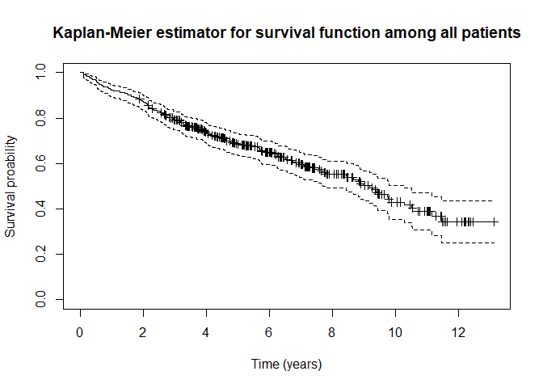
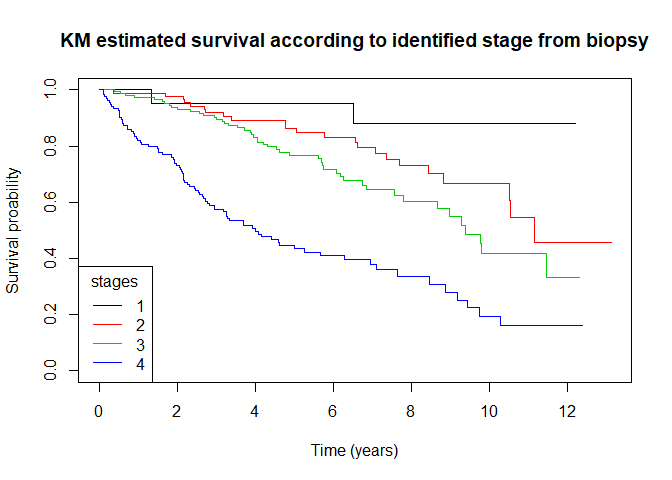
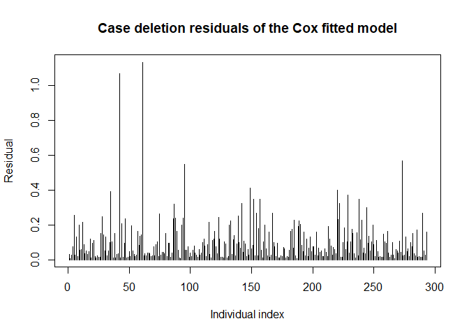
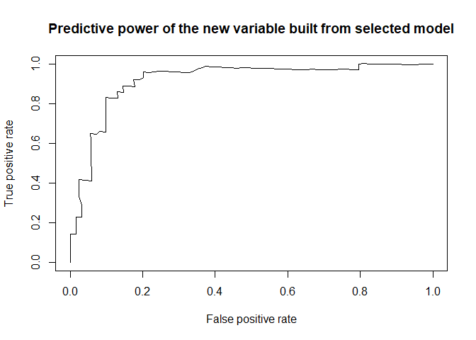
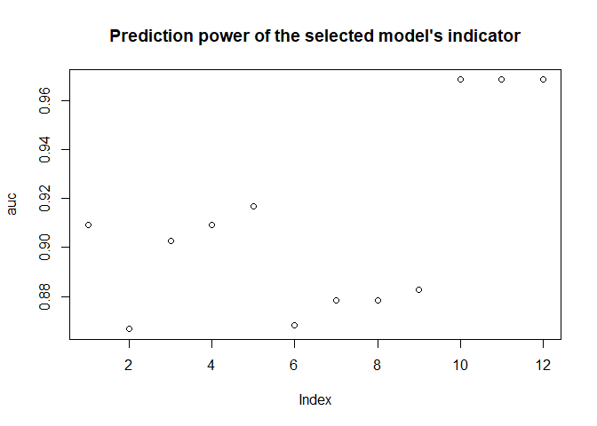
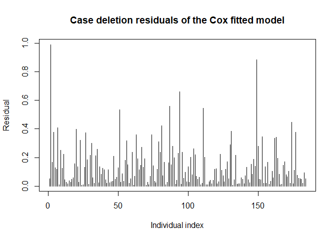
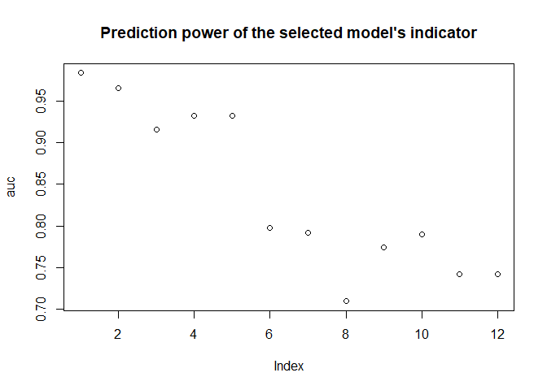
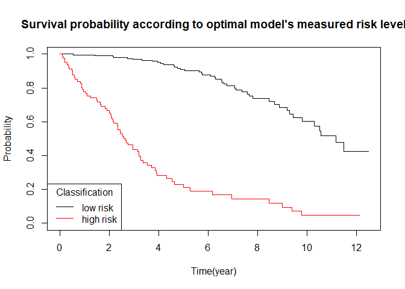

Survival analysis of pbc dataset
================
Marc Grossouvre
04/05/2020

# Data preparation

In this dataset, we follow patients with primary biliary cirrhosis (PBC)
of the liver. The output is either censored, transplant or dead. We
first define data types and look at global distribution of variables
values.

``` r
pbc0 <- as_tibble(pbc)
pbc0 <- mutate_at(pbc0, c("id", "status", "trt", "edema", "stage"), factor)
pbc0 <- mutate_at(pbc0, c("hepato", "ascites", "spiders"), as.logical)
pbc0 <- mutate(pbc0, time = time / 365.25 ) # measure time in years
```

# Preliminary study

## Data summary and description

``` r
summary(pbc0)
```

    ##        id           time         status    trt           age        sex    
    ##  1      :  1   Min.   : 0.1123   0:232   1   :158   Min.   :26.28   m: 44  
    ##  2      :  1   1st Qu.: 2.9918   1: 25   2   :154   1st Qu.:42.83   f:374  
    ##  3      :  1   Median : 4.7365   2:161   NA's:106   Median :51.00          
    ##  4      :  1   Mean   : 5.2506                      Mean   :50.74          
    ##  5      :  1   3rd Qu.: 7.1554                      3rd Qu.:58.24          
    ##  6      :  1   Max.   :13.1280                      Max.   :78.44          
    ##  (Other):412                                                               
    ##   ascites          hepato         spiders        edema          bili       
    ##  Mode :logical   Mode :logical   Mode :logical   0  :354   Min.   : 0.300  
    ##  FALSE:288       FALSE:152       FALSE:222       0.5: 44   1st Qu.: 0.800  
    ##  TRUE :24        TRUE :160       TRUE :90        1  : 20   Median : 1.400  
    ##  NA's :106       NA's :106       NA's :106                 Mean   : 3.221  
    ##                                                            3rd Qu.: 3.400  
    ##                                                            Max.   :28.000  
    ##                                                                            
    ##       chol           albumin          copper          alk.phos      
    ##  Min.   : 120.0   Min.   :1.960   Min.   :  4.00   Min.   :  289.0  
    ##  1st Qu.: 249.5   1st Qu.:3.243   1st Qu.: 41.25   1st Qu.:  871.5  
    ##  Median : 309.5   Median :3.530   Median : 73.00   Median : 1259.0  
    ##  Mean   : 369.5   Mean   :3.497   Mean   : 97.65   Mean   : 1982.7  
    ##  3rd Qu.: 400.0   3rd Qu.:3.770   3rd Qu.:123.00   3rd Qu.: 1980.0  
    ##  Max.   :1775.0   Max.   :4.640   Max.   :588.00   Max.   :13862.4  
    ##  NA's   :134                      NA's   :108      NA's   :106      
    ##       ast              trig           platelet        protime       stage    
    ##  Min.   : 26.35   Min.   : 33.00   Min.   : 62.0   Min.   : 9.00   1   : 21  
    ##  1st Qu.: 80.60   1st Qu.: 84.25   1st Qu.:188.5   1st Qu.:10.00   2   : 92  
    ##  Median :114.70   Median :108.00   Median :251.0   Median :10.60   3   :155  
    ##  Mean   :122.56   Mean   :124.70   Mean   :257.0   Mean   :10.73   4   :144  
    ##  3rd Qu.:151.90   3rd Qu.:151.00   3rd Qu.:318.0   3rd Qu.:11.10   NA's:  6  
    ##  Max.   :457.25   Max.   :598.00   Max.   :721.0   Max.   :18.00             
    ##  NA's   :106      NA's   :136      NA's   :11      NA's   :2

Covariates :  
age: in years  
albumin: serum albumin (g/dl)  
alk.phos: alkaline phosphotase (U/liter) ascites: presence of ascites  
ast: aspartate aminotransferase, once called SGOT (U/ml)  
bili: serum bilirunbin (mg/dl)  
chol: serum cholesterol (mg/dl)  
copper: urine copper (ug/day)  
edema: 0 no edema, 0.5 untreated or successfully treated  
1 edema despite diuretic therapy  
hepato: presence of hepatomegaly or enlarged liver  
id: case number  
platelet: platelet count  
protime: standardised blood clotting time  
sex: m/f  
spiders: blood vessel malformations in the skin  
stage: histologic stage of disease (needs biopsy)  
status: status at endpoint, 0/1/2 for censored, transplant, dead  
time: number of years between registration and the earlier of death,
transplantion, or study analysis in July, 1986  
trt: 1/2/NA for D-penicillmain, placebo, not randomised  
trig: triglycerides (mg/dl)

As explained in the data description, the set contains 312 randomized
patients for a trial of drug D-penicillamine and an additionnal 112
followed for survival but for whom only basic measurements have been
recorded. We observe that some covariates are very unevenly distributed
:

  - there are more than 8 times more women than men, but this is
    characteristic of this disease that affects women with a ratio 1:9
    \<www.journal-of-hepatology.eu/article/S0168-8278%2812%2900043-8/fulltext\>
    .
  - ‘bili’, ‘chol’, ‘copper’, ‘alk.phos’, ‘ast’, ‘protime’ and ‘trig’ to
    a certain extent, have similar distributions : dense for small
    values and a very large interval \[Q3, Q4\]. It might be useful to
    transform those variables when trying regression.

## View estimated survival

Now we look at overall survival : we remove transplanted cases as they
are rare and we can assume in a first approach that transplant depends
also on many non-physiological parameters, ethical in particular,
moreover the technology is changing quickly over such a period as 10
years and availability of donor is a crucial point.

``` r
pbc0 <- filter(pbc0, as.integer(status) != 2) # value 2 for level 1
pbc0 <- mutate(pbc0, status = as.integer ( as.integer(status) == 3 ) ) # value 3->level 2
fit.KM <- survfit( Surv( time, status ) ~ 1, data = pbc0, type = "kaplan-meier",
                   conf.type = "log-log") # this confidence interval is in [0, 1]
fit.KM
```

    ## Call: survfit(formula = Surv(time, status) ~ 1, data = pbc0, type = "kaplan-meier", 
    ##     conf.type = "log-log")
    ## 
    ##       n  events  median 0.95LCL 0.95UCL 
    ##  393.00  161.00    9.19    7.70   10.30

The estimated survival falls under 50% after 9 years. That can be
interpreted as : the probability that a patient observed at the
beginning will survive more than 9 years is 50%.

``` r
plot( fit.KM, mark.time = TRUE,
      main = "Kaplan-Meier estimator for survival function among all patients",
      xlab = "Time (years)", ylab = "Survival proability")
```

<!-- -->
We observe that although we cover a long period of more than 12 years,
the survival probability looks quite linear, suggesting a slow but
steady evolution of the disease. This is very different for example from
what can be observed with the ‘pancreatic’ dataset where the survival is
clearly exponentially decreasing. Pointwise confidence interval of the
estimator is quite small which says that the curve is meaningful.

**We will study the dataset in 4 steps :**

  - **Interpretation** thanks to parameters available for all patients
  - **Prediction** on the randomized set
  - Possible effect of **treatment**

# Interpretation

Before digging into the details of different physiological indicators,
we look at the possible effect of some key parameters : ‘stage’, ‘sex’
and ‘age’ (especially because of the length of the study)

## Try to explain survival from stage

``` r
KM_stage <- survfit( Surv( time, status ) ~ stage, data = pbc0, conf.type = "log-log" )
plot(KM_stage, col = 1:4,
     main = "KM estimated survival according to identified stage from biopsy",
     xlab = "Time (years)",
     ylab = "Survival proability")
legend("bottomleft", title = "stages",
       legend = levels(pbc0$stage),
       lty = 1, col = 1:4)
```

<!-- -->
We observe an impact of the stage, as expected. In particular, the
curvature of the function becomes upward for stage 4, indicating a high
mortality in the firts years after diagnostic. We also see that survival
is almost 100% for patients at stage 1 but the number of patients is
quite small at this stage, leading to high uncertainty. To get rid of
any doubt on that, we can check whether stage 1 and 2 are significantly
different or not :

``` r
pbc_temp <- pbc0[ pbc0$stage %in% c("1", "2"),  ]
logrank_stage <- survdiff( Surv( time, status ) ~ stage, data = pbc_temp )
logrank_stage
```

    ## Call:
    ## survdiff(formula = Surv(time, status) ~ stage, data = pbc_temp)
    ## 
    ##          N Observed Expected (O-E)^2/E (O-E)^2/V
    ## stage=1 21        2     5.45     2.188      2.82
    ## stage=2 87       23    19.55     0.611      2.82
    ## 
    ##  Chisq= 2.8  on 1 degrees of freedom, p= 0.09

p \> 5% : According to the logrank test, we can not reject the
hypothesis that survivals at stage 1 and 2 have the same distributions.
We decide to merge those 2 levels into a new indicator ‘stageM’

``` r
pbc0$stageM <- fct_collapse(pbc0$stage, "12" = c("1", "2"))
pbc_temp <- pbc0[ pbc0$stageM %in% c("12", "3"),  ]
logrank_stage <- survdiff( Surv( time, status ) ~ stageM, data = pbc_temp )
logrank_stage
```

    ## Call:
    ## survdiff(formula = Surv(time, status) ~ stageM, data = pbc_temp)
    ## 
    ##             N Observed Expected (O-E)^2/E (O-E)^2/V
    ## stageM=12 108       25     36.1      3.42      6.87
    ## stageM=3  145       48     36.9      3.34      6.87
    ## 
    ##  Chisq= 6.9  on 1 degrees of freedom, p= 0.009

p \< 5% : According to the logrank test, we reject the hypothesis that
stages 12 and 3 have the same distributions.  
On the other hand, if we compare stages 3 and 4 :

``` r
pbc_temp <- pbc0[ pbc0$stageM %in% c("3", "4"),  ]
logrank_stage <- survdiff( Surv( time, status ) ~ stageM, data = pbc_temp )
logrank_stage
```

    ## Call:
    ## survdiff(formula = Surv(time, status) ~ stageM, data = pbc_temp)
    ## 
    ##            N Observed Expected (O-E)^2/E (O-E)^2/V
    ## stageM=3 145       48     79.9      12.7      32.5
    ## stageM=4 134       84     52.1      19.5      32.5
    ## 
    ##  Chisq= 32.5  on 1 degrees of freedom, p= 1e-08

p \<\< 5% : there is no doubt that according to the stage 3 or 4 of the
patient, survival will be different (this is a consequence of the change
in curvature).

## Try to explain survival with sex

Similarly, we test the sex factor.

``` r
logrank_stage <- survdiff( Surv( time, status ) ~ sex, data = pbc0 )
logrank_stage
```

    ## Call:
    ## survdiff(formula = Surv(time, status) ~ sex, data = pbc0)
    ## 
    ##         N Observed Expected (O-E)^2/E (O-E)^2/V
    ## sex=m  41       24     17.4     2.529      2.85
    ## sex=f 352      137    143.6     0.306      2.85
    ## 
    ##  Chisq= 2.9  on 1 degrees of freedom, p= 0.09

But according to logrank test, we can not reject the fact that both sex
have same survival.

## Try to explain survival with age

To measure the effect of age, which is a continuous variable, we try to
measure the influence of age with a Cox proportional hazards model. To
implement this model, we assume that patients’hazard have a common time
dependent factor (this might be subject to discussion for such a long
time period) and differ only exponentially in other covariates (age in
this case). We work with age in decades for easier interpretation.

``` r
pbc0 <- mutate(pbc0, ageD = age / 10)
cox_age <- coxph( Surv( time, status ) ~ ageD, data = pbc0)
summary(cox_age)
```

    ## Call:
    ## coxph(formula = Surv(time, status) ~ ageD, data = pbc0)
    ## 
    ##   n= 393, number of events= 161 
    ## 
    ##         coef exp(coef) se(coef)     z Pr(>|z|)    
    ## ageD 0.35471   1.42576  0.07914 4.482 7.39e-06 ***
    ## ---
    ## Signif. codes:  0 '***' 0.001 '**' 0.01 '*' 0.05 '.' 0.1 ' ' 1
    ## 
    ##      exp(coef) exp(-coef) lower .95 upper .95
    ## ageD     1.426     0.7014     1.221     1.665
    ## 
    ## Concordance= 0.602  (se = 0.023 )
    ## Likelihood ratio test= 20.33  on 1 df,   p=7e-06
    ## Wald test            = 20.09  on 1 df,   p=7e-06
    ## Score (logrank) test = 20.31  on 1 df,   p=7e-06

We observe a significant influence of age on the hazard (p very small on
Wald test) with the following interpretation : When the age increases by
10 years, the risk (hazard) is multiplied by 1.4 . In particular, it
means that survival curve will decrease much faster for elder people.
But it is worth mentionning that quite a lot of patients are already
quite old at the beginning of the study and over 12 years, it is
expected that death toll among elders will be higher. Data should be
compared with a witness group to measure death toll without the disease
to confirm the hypothesis that the disease has a real impact risk of
elders.

## Try to find most proeminent covariates for interpretation

Based on the data that have been recorded for most patients, we proceed
to a variable selection based on AKIK information criteria which allows
comparing models based on a penalized likelihood based on the number of
used variables. Based on our preliminary study, we decide to introduce
the possibiliy to select the logarithm of ‘bili’ and ‘protime’ to spread
their values.

``` r
# we shift protime to increase the effect of log2
pbc0 <- mutate(pbc0, bili_log = log2(bili) , protime_log = log2( protime - 8 )  ) # 393 lines
pbc_full <- drop_na( pbc0[, c("id", "time", "status", "ageD", "sex", 
                              "stage", "stageM", "edema", "bili", "bili_log", 
                              "albumin", "platelet", "protime", "protime_log") ] )
full_model <- coxph( Surv(time, status) ~ ageD + stage + stageM + bili + bili_log 
                     + edema + albumin + platelet + protime + protime_log + sex,
                     data = pbc_full)
AIC_select <- step(full_model)
```

    ## Start:  AIC=1390.86
    ## Surv(time, status) ~ ageD + stage + stageM + bili + bili_log + 
    ##     edema + albumin + platelet + protime + protime_log + sex
    ## 
    ## 
    ## Step:  AIC=1390.86
    ## Surv(time, status) ~ ageD + stage + bili + bili_log + edema + 
    ##     albumin + platelet + protime + protime_log + sex
    ## 
    ##               Df    AIC
    ## - platelet     1 1388.9
    ## - protime_log  1 1389.3
    ## - sex          1 1390.1
    ## - bili         1 1390.3
    ## - stage        3 1390.3
    ## - protime      1 1390.6
    ## <none>           1390.9
    ## - edema        2 1395.3
    ## - ageD         1 1396.8
    ## - albumin      1 1398.9
    ## - bili_log     1 1420.3
    ## 
    ## Step:  AIC=1388.86
    ## Surv(time, status) ~ ageD + stage + bili + bili_log + edema + 
    ##     albumin + protime + protime_log + sex
    ## 
    ##               Df    AIC
    ## - protime_log  1 1387.3
    ## - sex          1 1388.1
    ## - bili         1 1388.3
    ## - stage        3 1388.4
    ## - protime      1 1388.6
    ## <none>           1388.9
    ## - edema        2 1393.9
    ## - ageD         1 1394.8
    ## - albumin      1 1396.9
    ## - bili_log     1 1418.5
    ## 
    ## Step:  AIC=1387.32
    ## Surv(time, status) ~ ageD + stage + bili + bili_log + edema + 
    ##     albumin + protime + sex
    ## 
    ##            Df    AIC
    ## - sex       1 1386.4
    ## - stage     3 1386.4
    ## - bili      1 1386.8
    ## <none>        1387.3
    ## - edema     2 1392.0
    ## - protime   1 1392.6
    ## - ageD      1 1393.3
    ## - albumin   1 1395.6
    ## - bili_log  1 1416.5
    ## 
    ## Step:  AIC=1386.37
    ## Surv(time, status) ~ ageD + stage + bili + bili_log + edema + 
    ##     albumin + protime
    ## 
    ##            Df    AIC
    ## - stage     3 1385.0
    ## - bili      1 1386.3
    ## <none>        1386.4
    ## - edema     2 1390.7
    ## - protime   1 1391.5
    ## - albumin   1 1394.4
    ## - ageD      1 1395.1
    ## - bili_log  1 1417.9
    ## 
    ## Step:  AIC=1385.01
    ## Surv(time, status) ~ ageD + bili + bili_log + edema + albumin + 
    ##     protime
    ## 
    ##            Df    AIC
    ## <none>        1385.0
    ## - bili      1 1386.3
    ## - edema     2 1390.0
    ## - protime   1 1392.9
    ## - ageD      1 1397.3
    ## - albumin   1 1397.9
    ## - bili_log  1 1426.6

We clearly see the benefit of introducing variable ‘bili\_log’ without
which final AIC would significantly increase. Considering the minor
impact of removing ‘bili’ in the last model, we decide to keep only :
‘edema’, ‘protime’, ‘age’, ‘albumin’ and ‘bili\_log’ in our selected
model :

``` r
pbc_best <- drop_na( pbc0[, c("id", "time", "status", "edema", 
                              "protime", "ageD", "albumin", "bili_log" ) ] ) 
# get patients that where removed by drop_na in full model 391 col 293/98 3/4 vs 1/4
set.seed(1618)
ind_learn <- shuffle(391)
pbc_learn <- pbc_best[ind_learn[1:293],]
pbc_valid <- pbc_best[ind_learn[294:391],]
cox_best <- coxph( Surv(time, status) ~ edema + protime + ageD
                   + albumin + bili_log, data = pbc_learn)
summary(cox_best)
```

    ## Call:
    ## coxph(formula = Surv(time, status) ~ edema + protime + ageD + 
    ##     albumin + bili_log, data = pbc_learn)
    ## 
    ##   n= 293, number of events= 115 
    ## 
    ##              coef exp(coef) se(coef)      z Pr(>|z|)    
    ## edema0.5  0.27974   1.32279  0.26907  1.040 0.298494    
    ## edema1    1.32636   3.76730  0.34397  3.856 0.000115 ***
    ## protime   0.12806   1.13662  0.08098  1.581 0.113816    
    ## ageD      0.42784   1.53395  0.09263  4.619 3.86e-06 ***
    ## albumin  -0.75190   0.47147  0.24811 -3.030 0.002442 ** 
    ## bili_log  0.61105   1.84236  0.07049  8.669  < 2e-16 ***
    ## ---
    ## Signif. codes:  0 '***' 0.001 '**' 0.01 '*' 0.05 '.' 0.1 ' ' 1
    ## 
    ##          exp(coef) exp(-coef) lower .95 upper .95
    ## edema0.5    1.3228     0.7560    0.7807    2.2414
    ## edema1      3.7673     0.2654    1.9197    7.3929
    ## protime     1.1366     0.8798    0.9698    1.3321
    ## ageD        1.5339     0.6519    1.2793    1.8393
    ## albumin     0.4715     2.1210    0.2899    0.7667
    ## bili_log    1.8424     0.5428    1.6046    2.1153
    ## 
    ## Concordance= 0.824  (se = 0.02 )
    ## Likelihood ratio test= 153.3  on 6 df,   p=<2e-16
    ## Wald test            = 158.8  on 6 df,   p=<2e-16
    ## Score (logrank) test = 207.2  on 6 df,   p=<2e-16

According to the Harrell’s oncordance index, 83% of pairs of patients
are correctly ordered by the model which is quite good. According to the
Wald test on each variable, we reject the hypothesis that those
coefficients are null except for ‘edema0.5’ (untreated or successfully
treated edema) and ‘protime’. This is understandable as ‘edema0.5’
defines a very small class and any estimation would be doubtfull.
Regarding ‘protime’, as mentionned before the spreading of values is
concentrated at the begining of the range interval making prediction on
higer values quite uncertain.

We first check that there is no individual disturbing the sample :

``` r
del_res <- residuals( cox_best, type = 'dfbetas')
pbc_learn$dfbetas <- sqrt( rowSums( del_res ^2 ) )
plot(pbc_learn$dfbetas, type = 'h',
     main = "Case deletion residuals of the Cox fitted model",
     xlab = "Individual index",
     ylab = "Residual")
```

<!-- -->
It turns out that we should remove 2 individuals that have a
disproportionate weight on our model. We also remove ‘edema0.5’ because
of poor Wald test and low impact.

``` r
out_indiv <- sort(pbc_learn$dfbetas)[292:293]
pbc_learn2 <- filter( pbc_learn, ! dfbetas %in% out_indiv)
pbc_learn2 <- mutate( pbc_learn2, edemaM = as.integer( as.integer( edema == 1 ) ) )
cox_best <- coxph( Surv(time, status) ~ edemaM + protime + ageD + albumin + bili_log,
                   data = pbc_learn2)
summary(cox_best)
```

    ## Call:
    ## coxph(formula = Surv(time, status) ~ edemaM + protime + ageD + 
    ##     albumin + bili_log, data = pbc_learn2)
    ## 
    ##   n= 291, number of events= 115 
    ## 
    ##              coef exp(coef) se(coef)      z Pr(>|z|)    
    ## edemaM    1.01592   2.76190  0.34709  2.927 0.003423 ** 
    ## protime   0.33059   1.39179  0.10774  3.069 0.002151 ** 
    ## ageD      0.50296   1.65360  0.10516  4.783 1.73e-06 ***
    ## albumin  -0.82813   0.43687  0.23527 -3.520 0.000432 ***
    ## bili_log  0.64504   1.90606  0.07289  8.850  < 2e-16 ***
    ## ---
    ## Signif. codes:  0 '***' 0.001 '**' 0.01 '*' 0.05 '.' 0.1 ' ' 1
    ## 
    ##          exp(coef) exp(-coef) lower .95 upper .95
    ## edemaM      2.7619     0.3621    1.3988    5.4532
    ## protime     1.3918     0.7185    1.1269    1.7190
    ## ageD        1.6536     0.6047    1.3456    2.0321
    ## albumin     0.4369     2.2890    0.2755    0.6928
    ## bili_log    1.9061     0.5246    1.6523    2.1988
    ## 
    ## Concordance= 0.827  (se = 0.021 )
    ## Likelihood ratio test= 167.2  on 5 df,   p=<2e-16
    ## Wald test            = 160.8  on 5 df,   p=<2e-16
    ## Score (logrank) test = 218.8  on 5 df,   p=<2e-16

Concordance is the same. We observe a significant difference as the Wald
test on variables has significantly improved for ‘protime’ coefficient,
with quite a significant change in value.

In terms of interpretation :

  - ‘edemaM’ : the presence of an edema despite diuretic therapy
    multiplies risk of death by 2.8 compared to absence of edema,
    untreated of successfully treated edema.
  - ‘protime’ : an increase of 1 time unit in standardised blood
    clotting time multiplies the risk of death by 1.4 . Based on the
    observed distribution, it means that a small group of patients are
    at very high risk.
  - ‘ageD’ : one more decade in age multiplies risk by 1.7 .
  - ‘albumin’ : albumin has a negative effect on hazard : an increase of
    1 g/dl in serum albumin divides the risk of death by 2.3 .
  - ‘bili\_log’ : doubling the serum bilirunbin in g/dl multiplies risk
    of death by 1.9, same remark as for ‘protime’ .

We assess the predictive power of our model on the validation set. Using
the model’s coefficients to create a new covariate, we assess the
predictive power of this covariate on validation set after 5 years.

``` r
pbc_valid <- mutate( pbc_valid, edemaM = as.integer( as.integer( edema == 1 ) ) )
cc <- cox_best$coefficients
pbc_valid <- mutate(pbc_valid, best_coef = cc[1] * edemaM + cc[2] * protime
                    + cc[3] * ageD + cc[4] * albumin + cc[5] * bili_log)
ROC_predict <- survivalROC( Stime = pbc_valid$time,
                            status = pbc_valid$status,
                            marker = pbc_valid$best_coef,
                            predict.time = 5, method = "KM")
plot(ROC_predict$FP, ROC_predict$TP, type = 'l',
     main = "Predictive power of the new variable built from selected model",
     xlab = "False positive rate",
     ylab = "True positive rate")
```

<!-- -->
The shape of the curve after 5 years is as expected, quite far from the
diagonal. We assess area under the curve for each year :

``` r
auc <- rep(0, 12)
for (i in 1:12){
  auc[i] <- survivalROC( Stime = pbc_valid$time,
                            status = pbc_valid$status,
                            marker = pbc_valid$best_coef,
                            predict.time = i, method = "KM")$AUC
}
plot(auc, main = "Prediction power of the selected model's indicator")
```

<!-- -->
The AUC is constantly above 85% which is a very good result. We can
therefore rely on the interpretation that has been made.

# Build a prediction oriented model on randomized set

To focus on prediction, we prefer using more variables. We work with the
randomized set of patients and remove all missing variables. We work
with time in years, age in decades. In order to work with glmnet, we
convert all variables to numeric values. Based on previous study we add
as extra variables the logarithm of those variables that are dense for
small values and rare for large values.  
Then we select the optimal model through cross validation computed on
the learning set (better with cross validation due to small size of the
sample).

``` r
pbc0 <- as_tibble(pbc)[1:312,]
pbc0 <- mutate(pbc0, time = time / 365 ) # measure time in years
pbc0 <- mutate(pbc0, age = age / 10)
pbc0 <- mutate(pbc0, status = as.integer (status == 2))
pbc0 <- mutate(pbc0, sex = as.integer (sex == "m"))
relog <- function(x) log2(scale(x, center = FALSE))
pbc0 <- mutate(pbc0, bili_log = relog(bili),
               protime_log = relog(protime-8),
               chol_log = relog(chol),
               copper_log = relog(copper),
               alk.phos_log = relog(alk.phos),
               ast_log = relog(ast),
               trig_log = relog(trig),
               edemaU = as.integer( as.integer( edema == 0.5 ) ),
               edemaT = as.integer( as.integer( edema == 1 ) ),
               stage2 = as.integer( as.integer( stage == "2" ) ),
               stage3 = as.integer( as.integer( stage == "3" ) ),
               stage4 = as.integer( as.integer( stage == "4" ) ),
               stage1 = as.integer( as.integer( stage == "1" ) ),)
pbc0 <- drop_na(pbc0) # 276 rows
set.seed(314)
ind_learn <- shuffle(276)
rand_learn <-pbc0[ind_learn[1:184],]
rand_valid <- pbc0[ind_learn[185:276],]
n <- length(rand_learn)
fit_best <- cv.glmnet(as.matrix(rand_learn[,4:n]), 
                      Surv(rand_learn$time, rand_learn$status), family = 'cox')
cc <- coef(fit_best)
print(cc)
```

    ## 30 x 1 sparse Matrix of class "dgCMatrix"
    ##                         1
    ## trt           .          
    ## age           0.053569807
    ## sex           .          
    ## ascites       0.677782768
    ## hepato        .          
    ## spiders       .          
    ## edema         0.012511725
    ## bili          .          
    ## chol          .          
    ## albumin      -0.248454541
    ## copper        0.002022288
    ## alk.phos      .          
    ## ast           .          
    ## trig          .          
    ## platelet      .          
    ## protime       .          
    ## stage         0.081142604
    ## bili_log      0.347060814
    ## protime_log   0.125237853
    ## chol_log      .          
    ## copper_log    .          
    ## alk.phos_log  .          
    ## ast_log       .          
    ## trig_log      .          
    ## edemaU        .          
    ## edemaT        .          
    ## stage2        .          
    ## stage3        .          
    ## stage4        .          
    ## stage1        .

As expected, the selected model has more variables than the previous
one. We recompute the Cox model based on this result and the learning
set. By the way, we see that log values of ‘bili’ and ‘protime’ have
been selected. We also see the importance of stage as seen before.

``` r
cox_rand <- coxph( Surv(time, status) ~ age + ascites + edema + albumin 
                   + copper + stage + bili_log + protime_log,
                   data = rand_learn )
summary(cox_rand)
```

    ## Call:
    ## coxph(formula = Surv(time, status) ~ age + ascites + edema + 
    ##     albumin + copper + stage + bili_log + protime_log, data = rand_learn)
    ## 
    ##   n= 184, number of events= 75 
    ## 
    ##                  coef exp(coef)  se(coef)      z Pr(>|z|)    
    ## age          0.410063  1.506913  0.121429  3.377 0.000733 ***
    ## ascites      0.769068  2.157753  0.444864  1.729 0.083850 .  
    ## edema        0.220677  1.246920  0.426375  0.518 0.604762    
    ## albumin     -0.786865  0.455270  0.327524 -2.402 0.016285 *  
    ## copper       0.004519  1.004529  0.001380  3.273 0.001063 ** 
    ## stage        0.320742  1.378149  0.178251  1.799 0.071958 .  
    ## bili_log     0.441952  1.555741  0.107721  4.103 4.08e-05 ***
    ## protime_log  0.640922  1.898231  0.310190  2.066 0.038807 *  
    ## ---
    ## Signif. codes:  0 '***' 0.001 '**' 0.01 '*' 0.05 '.' 0.1 ' ' 1
    ## 
    ##             exp(coef) exp(-coef) lower .95 upper .95
    ## age            1.5069     0.6636    1.1878    1.9118
    ## ascites        2.1578     0.4634    0.9023    5.1603
    ## edema          1.2469     0.8020    0.5406    2.8759
    ## albumin        0.4553     2.1965    0.2396    0.8651
    ## copper         1.0045     0.9955    1.0018    1.0073
    ## stage          1.3781     0.7256    0.9718    1.9544
    ## bili_log       1.5557     0.6428    1.2596    1.9215
    ## protime_log    1.8982     0.5268    1.0335    3.4865
    ## 
    ## Concordance= 0.86  (se = 0.024 )
    ## Likelihood ratio test= 137.8  on 8 df,   p=<2e-16
    ## Wald test            = 125.3  on 8 df,   p=<2e-16
    ## Score (logrank) test = 214.1  on 8 df,   p=<2e-16

We plot case deletion residuals.

``` r
del_res <- residuals( cox_rand, type = 'dfbetas')
rand_learn$dfbetas <- sqrt( rowSums( del_res ^2 ) )
plot(rand_learn$dfbetas, type = 'h',
     main = "Case deletion residuals of the Cox fitted model",
     xlab = "Individual index",
     ylab = "Residual")
```

<!-- -->
In general we can regret that residuals are more important than
previously but it is the price to pay for reducing the sample size. We
observe 2 individuals that perturbate the model, we remove them and
recompute the model.

``` r
r <- nrow(rand_learn)
out_indiv <- sort(rand_learn$dfbetas)[(r-1):r]
rand_learn <- filter( rand_learn, ! dfbetas %in% out_indiv)
cox_rand <- coxph( Surv(time, status) ~ age + ascites + edema 
                   + albumin + copper + stage + bili_log + protime_log, 
                   data = rand_learn )
summary(cox_rand)
```

    ## Call:
    ## coxph(formula = Surv(time, status) ~ age + ascites + edema + 
    ##     albumin + copper + stage + bili_log + protime_log, data = rand_learn)
    ## 
    ##   n= 182, number of events= 74 
    ## 
    ##                  coef exp(coef)  se(coef)      z Pr(>|z|)    
    ## age          0.349211  1.417948  0.121210  2.881 0.003964 ** 
    ## ascites      0.999449  2.716785  0.501169  1.994 0.046126 *  
    ## edema        0.418229  1.519269  0.443320  0.943 0.345475    
    ## albumin     -0.979911  0.375344  0.310743 -3.153 0.001614 ** 
    ## copper       0.005042  1.005055  0.001301  3.874 0.000107 ***
    ## stage        0.365988  1.441938  0.181880  2.012 0.044193 *  
    ## bili_log     0.486968  1.627374  0.103488  4.706 2.53e-06 ***
    ## protime_log  0.732291  2.079841  0.307258  2.383 0.017158 *  
    ## ---
    ## Signif. codes:  0 '***' 0.001 '**' 0.01 '*' 0.05 '.' 0.1 ' ' 1
    ## 
    ##             exp(coef) exp(-coef) lower .95 upper .95
    ## age            1.4179     0.7052    1.1181    1.7982
    ## ascites        2.7168     0.3681    1.0173    7.2552
    ## edema          1.5193     0.6582    0.6372    3.6223
    ## albumin        0.3753     2.6642    0.2041    0.6901
    ## copper         1.0051     0.9950    1.0025    1.0076
    ## stage          1.4419     0.6935    1.0096    2.0595
    ## bili_log       1.6274     0.6145    1.3286    1.9933
    ## protime_log    2.0798     0.4808    1.1389    3.7981
    ## 
    ## Concordance= 0.862  (se = 0.024 )
    ## Likelihood ratio test= 149.8  on 8 df,   p=<2e-16
    ## Wald test            = 125.8  on 8 df,   p=<2e-16
    ## Score (logrank) test = 233.9  on 8 df,   p=<2e-16

We observe that coefficient’s p-values have been improved. Coefficients
values are consistent with previous results (risk mutliplied by 1.5 for
age increasing by 1 decade for instance). We now assess the predictive
power of our model on the validation set at the end of each year.

``` r
cc <- cox_rand$coefficients
rand_valid <- mutate(rand_valid, best_coef = cc[1]*age + cc[2]*ascites + cc[3]*edema + cc[4]*albumin + cc[5]*copper + cc[6]*stage + cc[7]*bili_log + cc[8]*protime_log)
auc <- rep(0, 12)
for (i in 1:12){
  auc[i] <- survivalROC( Stime = rand_valid$time,
                            status = rand_valid$status,
                            marker = rand_valid$best_coef,
                            predict.time = i, method = "KM")$AUC
}
plot(auc, main = "Prediction power of the selected model's indicator")
```

<!-- -->
We observe a very good predictive power for the first 5 years, followed
by a significant drop. This suggests that proportionnality of hazards is
not verified on such a long period, as if the dynamic of the disease
would change after 5 years. A possible improvement of the model would be
to truncate time and keep data between 0 and 5 years. In any case we can
use it with confidence of the first 5 years. We can also observe that
our previous model had less variables and a smaller predictive power for
the first five year but the AUC was constantly above 85% .

## Determine population most at risk

We determine a cutoff value of the new built indicator to isolate
population most at risk within 5 years. We look for the cutoff value
such that the false positive rate at this level is smaller than 10% (90%
of the predicted death will be observed).

``` r
pbc0 <- mutate(pbc0, best_coef = cc[1]*age + cc[2]*ascites + cc[3]*edema 
               + cc[4]*albumin + cc[5]*copper + cc[6]*stage + cc[7]*bili_log 
               + cc[8]*protime_log)
auc <- survivalROC( Stime = pbc0$time,
                            status = pbc0$status,
                            marker = pbc0$best_coef,
                            predict.time = 5, method = "KM")
cutoff <- with(auc, min(cut.values[FP <= 0.1]))
cutTP <- with(auc, max(TP[FP <= 0.1]))
pbc0$pred_risk <- ifelse( pbc0$best_coef <= cutoff, 0, 1)
plot( survfit( Surv( time, status ) ~ pred_risk, data = pbc0 ), col = 1:2,
      main = "Survival probability according to optimal model's measured risk level",
      xlab = "Time(year)",
      ylab = "Probability")
legend("bottomleft", title = "Classification",
       legend = c("low risk", "high risk"),
       lty = 1, col = 1:2)
```

<!-- -->

``` r
print(cutTP)
```

    ## [1] 0.7872615

At this cutoff, 79% of predicted survivals are observed.

We observe a steep descent of survival for the red curve in the 5 first
years as expected. Considering the large gap between both curves and the
change of curvature, we can use this cutoff to predict partients
survival probability after 5 years. In particular the medians (time
period after which 50% of patients die) are very different from one
another : between 2 and 3 years for patients at risk, more than 10 years
for patients with lower risk.

# Effect of treatment

We first notice that in the previous study, we had left the ‘trt’
covariate in the learning set and the variable has not been selected. We
can therefore already observe that treatment is not very significant in
the survival prediction. We test a possible difference between the
survival functions with or without treatment.

``` r
test_trt <- survdiff( Surv(time, status) ~ trt, data = pbc0 )
test_trt
```

    ## Call:
    ## survdiff(formula = Surv(time, status) ~ trt, data = pbc0)
    ## 
    ##         N Observed Expected (O-E)^2/E (O-E)^2/V
    ## trt=1 136       57     53.7     0.209     0.405
    ## trt=2 140       54     57.3     0.195     0.405
    ## 
    ##  Chisq= 0.4  on 1 degrees of freedom, p= 0.5

We can not reject the hypothesis that treatment has no effect on
survival overall. We try to stratify the data to limitate the effect of
other very significant variables in measuring the treatment effect.
First, we look at age classes by decades :

``` r
pbc0 <- mutate(pbc0, ageClass = floor( age ) )
test_trt <- survdiff( Surv(time, status) ~ trt + strata(ageClass), data = pbc0)
test_trt
```

    ## Call:
    ## survdiff(formula = Surv(time, status) ~ trt + strata(ageClass), 
    ##     data = pbc0)
    ## 
    ##         N Observed Expected (O-E)^2/E (O-E)^2/V
    ## trt=1 136       57     56.5   0.00444   0.00937
    ## trt=2 140       54     54.5   0.00460   0.00937
    ## 
    ##  Chisq= 0  on 1 degrees of freedom, p= 0.9

The treatment does not seem to have any particular effect on patients of
same age class. We have similar results when we try to remove the effect
of stage or ascites. We look at another significant covariate,
‘protime\_log’.

``` r
summary(pbc0$protime_log)
```

    ##        V1         
    ##  Min.   :-1.5405  
    ##  1st Qu.:-0.5405  
    ##  Median :-0.1620  
    ##  Mean   :-0.1720  
    ##  3rd Qu.: 0.1376  
    ##  Max.   : 1.6454

We isolate the last quarter of the population.

``` r
test_trt <- survdiff( Surv(time, status) ~ trt, 
                      data = pbc0[ as.vector( pbc0$protime_log > 0.13 ), ] )
test_trt
```

    ## Call:
    ## survdiff(formula = Surv(time, status) ~ trt, data = pbc0[as.vector(pbc0$protime_log > 
    ##     0.13), ])
    ## 
    ##        N Observed Expected (O-E)^2/E (O-E)^2/V
    ## trt=1 27       21     14.5      2.88      4.28
    ## trt=2 44       27     33.5      1.25      4.28
    ## 
    ##  Chisq= 4.3  on 1 degrees of freedom, p= 0.04

We identify a significant impact of treatment on this group. But
unfortunately, it is a negative impact. Death toll is much higher on
treated group than on group receiving placebo.

We can not conclude with any significant positive effect of the
treatment. But we can identify a group for which the effect is negative.

# Conclusion

In this study, we have identified some significant covariates on
survival probability of patients. We have built a model simple enough
for interpretation and wuite powerful in prediction. We have built a
model for prediction very powerful for predicting death in the first 5
years after diagnostic. We have not found any positive impact of
treatment.
